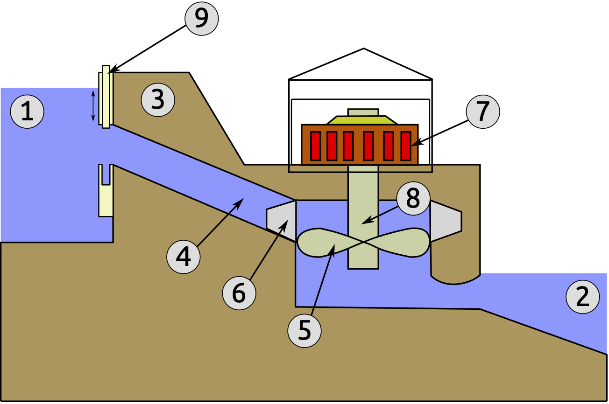
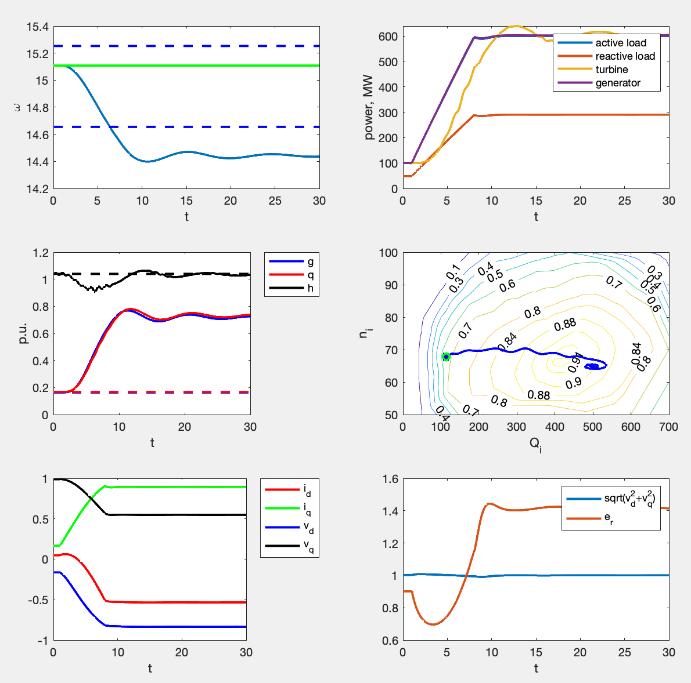

# Sayano-Shushenskaya HPP Model
This work is devoted to the construction and study of a mathematical model of hydropower unit, consisting of synchronous generator, hydraulic turbine, speed governor, exceiter, and electrical load.
It is motivated by the accident happened on the Sayano-Shushenskaya hydropower plant in 2009. Parameters of the hydropower plant were used to model the system.
This model was used to publish paper [Analytical-numerical analysis of dynamical model of Sayano-Shushenskaya hydropower plant: stability, oscillations, and accident](https://www.sciencedirect.com/science/article/abs/pii/S1007570420303609).

# General model description
Consider the main elements of hydro power plant unit.

The hydropower unit of Sayano-Shushenskaya HPP consists of synchronous generator and Francis hydraulic turbine.
The rotor of generator and the runner are connected together by a rigid shaft.


The dam creates a difference in water level between the upper reservoir and lower reservoir. The flow of water is delivered from  upper reservoir to turbine by penstock through the spiral casing.
Water jets impact on the blades of the turbine producing torque applied to the rotating shaft.
Since the turbine shaft is rigidly connected with the generator rotor,
the rotor starts to rotate and to produce electricity, which is transferred to the grid.
The water flow is controlled by means of guide vanes.

For the safety of the power network, the frequency should remain almost constant.
This is reached by keeping the same speed of the synchronous generator. The rotational speed is controlled by the speed governor.


## What is modeled:

* Hydraulic turbine + penstock, ```TurbineModel1.m```.
Hydro turnie is modeled using non-linear zero-order model(no odes, only functional mapping). Graph of the constant efficiency level lines obtained experimentally us used.
Penstock is modeled using the inelastic model (1 ODE).
* Electrical generator is modeled using classical Park equations (5 ODEs). Magnetic saturation is not taken into account.
* Exceiter model, ```ExciterModelAC4A.m``` - standard AC4A model. ```ExciterPIModel.m``` - PI controller based exciter.
* Load model, ```LoadModelPQ.m```. Constant active and reactive power (0 ODEs), or constant impedance. Simulates active power going from initial P to 600 MW.
* Governor, ```GovernorModelSSHG.m```. Slightly modified PI controller (3 ODEs)
* Shaft and turbine rotation speed is computed using the 1-d mechanical model of solid rotating body with given inertia (1 ODE): $d\omega = (T_{\rm turbine}+T_{\rm electrical})/{\rm complete_inertia}$

What this model does:

1. Initialize model with sensible parameters
2. Estimate the steady state

## How to run the code

Run ```complete_simulation.m``` file.
In several seconds it should plot the simulation results
