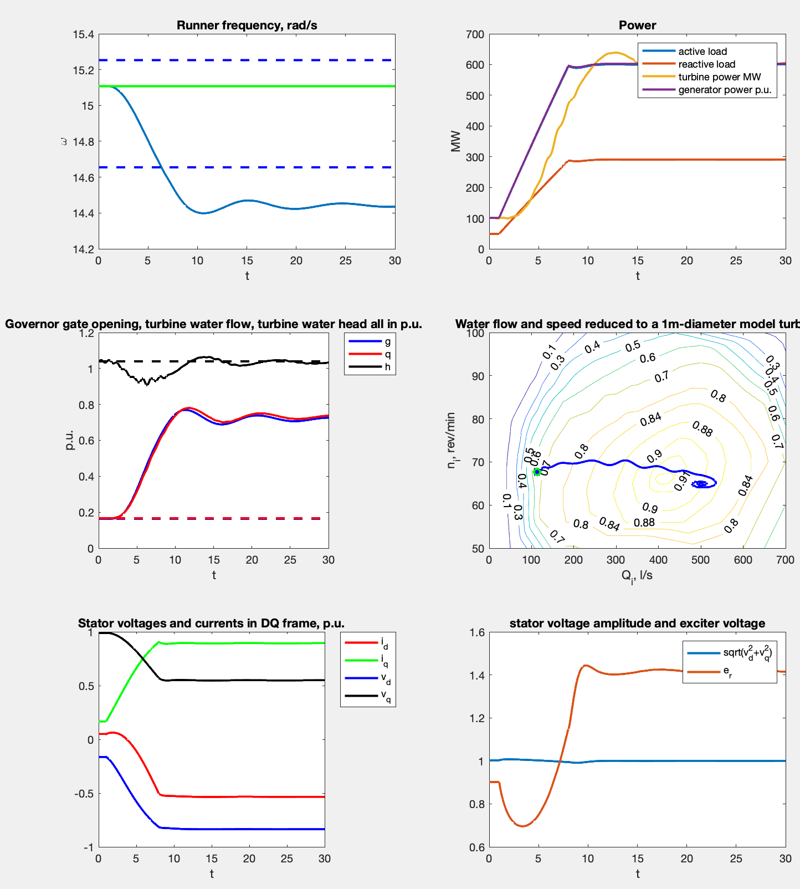

# Sayan-Shushenskaya HPP Model

Here I implemented model of Sayano-Shushenskaya hydro power plant in Matlab.

What is modeled:
1. Hydraulic turbine + penstock, ```TurbineModel1.m```.
Hydro turnie is modeled using non-linear zero-order model(no odes, only functional mapping). Graph of the constant efficiency level lines obtained experimentally us used.
Penstock is modeled using the inelastic model (1 ODE).
2. Electrical generator is modeled using classical Park equations (5 ODEs). Magnetic saturation is not taken into account.
3. Exceiter model, ```ExciterModelAC4A.m``` - standard AC4A model. ```ExciterPIModel.m``` - PI controller based exciter.
4. Load model, ```LoadModelPQ.m```. Constant active and reactive power (0 ODEs), or constant impedance. Simulates active power going from initial P to 600 MW.
5. Governor, ```GovernorModelSSHG.m```. Slightly modified PI controller (3 ODEs)
6. Shaft and turbine rotation speed is computed using the 1-d mechanical model of solid rotating body with given inertia (1 ODE): $d\omega = (T_{\rm turbine}+T_{\rm electrical})/{\rm complete_inertia}$

What this model does:

1. Initialize model with sensible parameters
2. Estimate the steady state

## How to run the code

Run ```complete_simulation.m``` file.
In several seconds it should plot the simulation results
